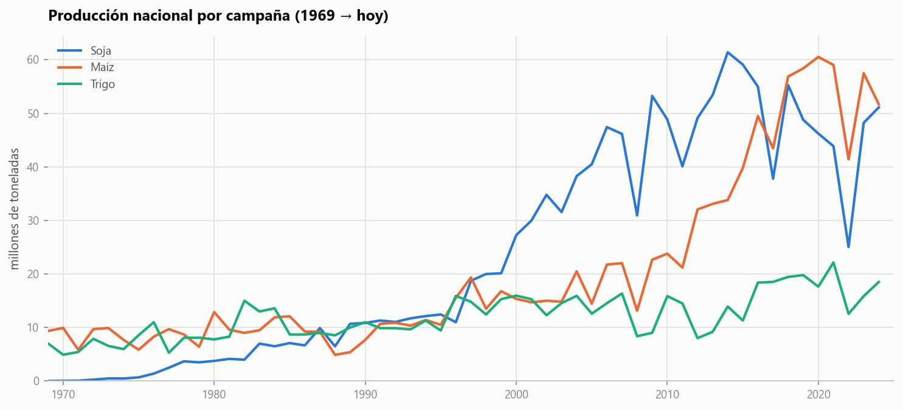
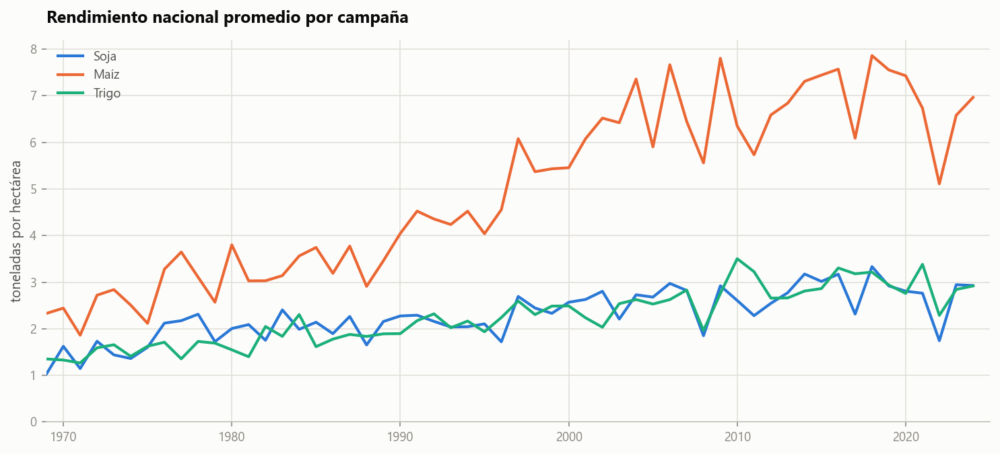
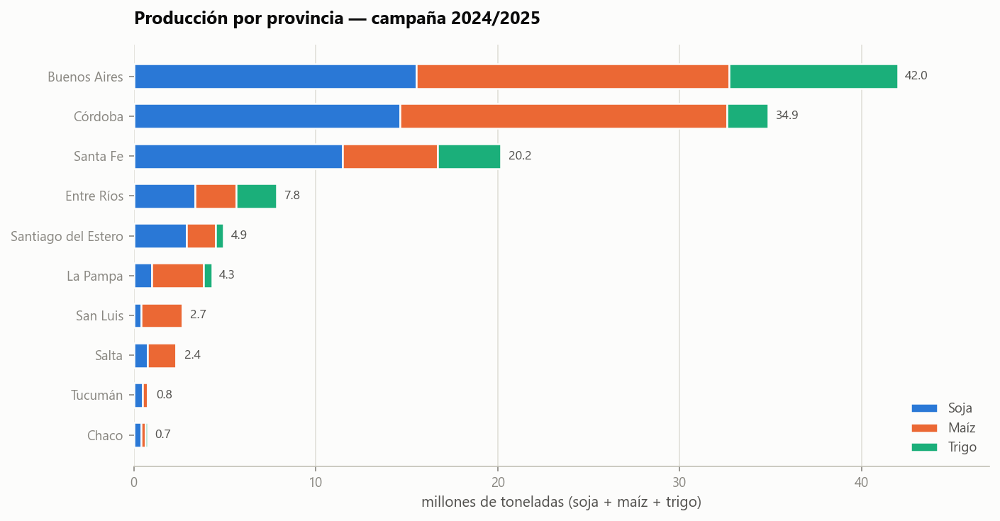
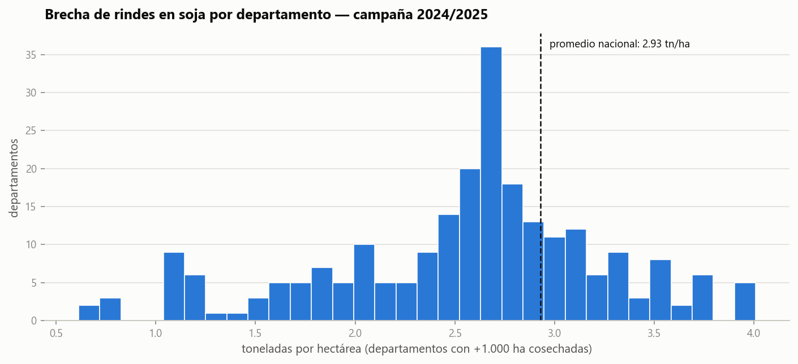

# Rindes agrícolas en Argentina 🌾

Análisis histórico de la producción de **soja, maíz y trigo** en Argentina sobre
las **Estimaciones Agrícolas oficiales** de la Secretaría de Agricultura,
Ganadería y Pesca: **56 campañas (1969/70 → 2024/25)** con superficie, producción
y rendimiento por departamento.

**Stack:** Python · Pandas · Matplotlib

---

## Qué muestra el análisis

- La soja pasó de cultivo marginal en los 70 (menos de 1 M tn) a picos de
  60 M tn, aunque en las últimas campañas el maíz la alcanzó y por momentos la
  superó. Es un cambio estructural del agro argentino que se ve clarísimo en la
  serie histórica.
- El rinde del maíz casi se triplicó desde los años 90, de ~2,5 a ~7 tn/ha,
  empujado por genética e intensificación. Soja y trigo mejoraron a un ritmo
  mucho menor y hoy rondan las 3 tn/ha.
- Buenos Aires (42 M tn), Córdoba (34,9) y Santa Fe (20,2) concentran la mayor
  parte del volumen de los tres cultivos en 2024/25. La zona núcleo sigue
  mandando.
- En soja conviven departamentos que superan 3,5 tn/ha con otros por debajo de
  1,5. Esa brecha marca dos realidades productivas distintas (núcleo vs.
  extra-pampeana) y da una idea del margen de mejora que existe fuera de la
  zona núcleo.

## Visualizaciones

### Producción nacional histórica


### Evolución del rendimiento


### Concentración geográfica


### Brecha de rindes


## Fuente de datos

[Estimaciones Agrícolas](https://datos.magyp.gob.ar/dataset/estimaciones-agricolas)
— Secretaría de Agricultura, Ganadería y Pesca, República Argentina.
Datos abiertos con ~160.000 registros por cultivo, campaña, provincia y
departamento desde 1969.

## Reproducir el análisis

```bash
pip install -r requirements.txt

# 1. Descargar los datos (~15 MB)
python src/descargar_datos.py

# 2. Generar las figuras
python src/analisis.py
```

## Estructura

```
├── src/
│   ├── descargar_datos.py   # descarga del dataset oficial
│   └── analisis.py          # series históricas, rankings y brecha de rindes
├── figures/                 # gráficos generados (PNG)
├── data/                    # datos crudos (no versionados)
└── requirements.txt
```

## Notas metodológicas

- Se usan las categorías `soja total`, `maíz` y `trigo total` del dataset.
- El rendimiento nacional se calcula ponderado (producción total / superficie
  cosechada total), no como promedio simple de departamentos.
- En la brecha de rindes se consideran solo departamentos con más de 1.000 ha
  cosechadas para evitar ruido de lotes chicos.

---

**Clemente Cifuentes** — Data Analyst ·
[LinkedIn](https://linkedin.com/in/clementecifuentes) ·
[Portafolio](https://github.com/clementecifuentes)
